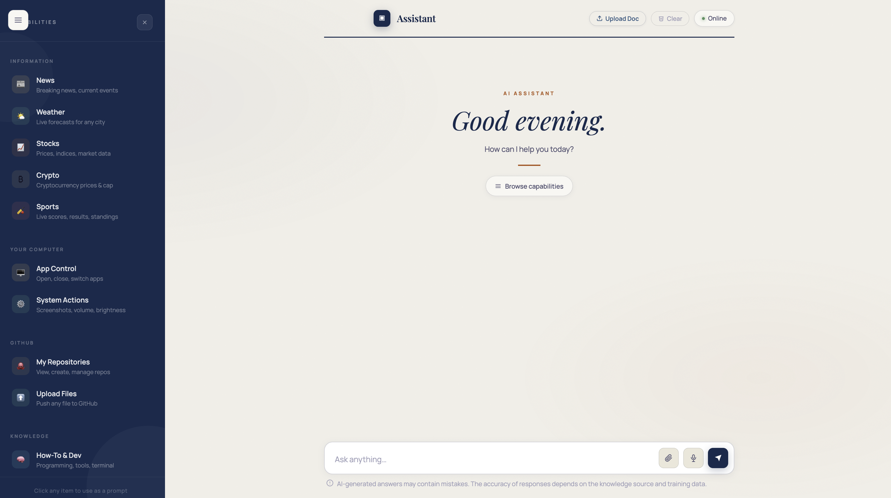
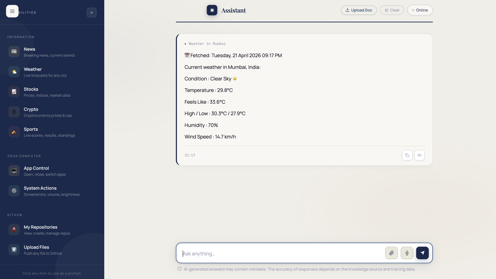
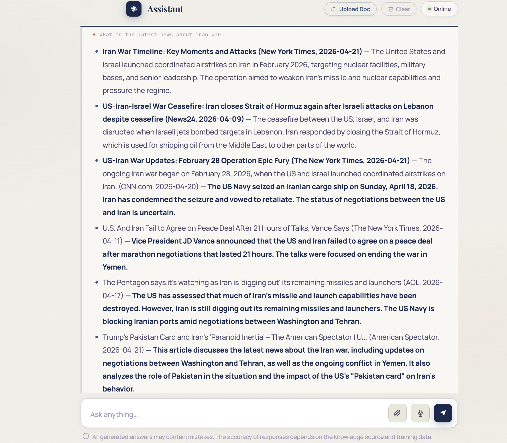
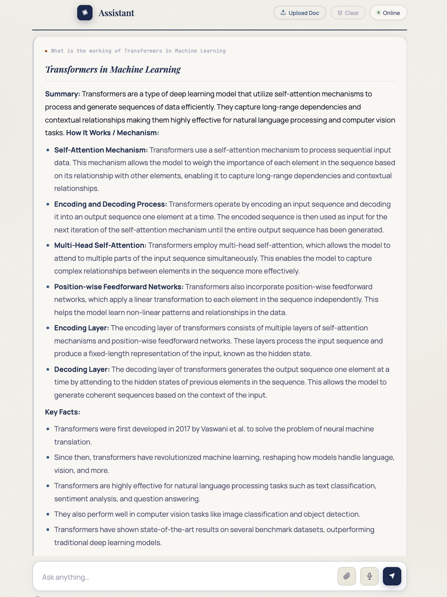

# Local AI RAG Assistant

**Agentic, multi-tool Retrieval-Augmented Generation system running fully locally using Mistral 7B via Ollama.**

---

## 🚀 Overview

This project is a **privacy-first AI assistant** that combines **Hybrid RAG (vector + keyword search)** with a **multi-tool routing engine** to generate intelligent, context-aware responses.

Unlike basic chatbots, this system dynamically selects tools (APIs, system commands, knowledge base) and integrates their outputs through structured reasoning — all **running entirely on your local machine**.

---

## 📸 Demo

### 🏠 Home Interface
<p align="center">
  
</p>

### 🌦️ Weather Tool Example
<p align="center">
  
</p>

### 📰 News Retrieval (RAG + Tool)
<p align="center">
  
</p>

### 📰 Internet Search Retrieval (RAG + Tool)
<p align="center">
  
</p>

### UI Preview


### Example Interaction


---

## ✨ Key Features

* 🧠 **Hybrid RAG Pipeline** — Semantic search + BM25 with cross-encoder reranking
* 🔀 **Agentic Tool Routing** — Dynamically selects the right tool based on query intent
* 🧩 **Multi-Tool Execution** — Supports parallel tool calls and query decomposition
* 📚 **Knowledge Base** — Persistent vector DB with document ingestion
* 🗣️ **Voice Interface** — Whisper (STT) + pyttsx3 (TTS)
* 🐙 **GitHub Integration** — Repo management and file operations
* 🖥️ **System Commands** — Execute OS-level actions (macOS-based)
* 🧩 **Session Memory** — Context retention with expiry
* 💻 **Web UI** — FastAPI backend with clean frontend

---

## 🏗️ Architecture
<p align="center">
  
</p>


---

## 🛠️ Tech Stack

| Layer      | Technology            |
| ---------- | --------------------- |
| LLM        | Mistral 7B via Ollama |
| Embeddings | sentence-transformers |
| Vector DB  | ChromaDB              |
| Search     | BM25 (rank-bm25)      |
| Reranker   | cross-encoder         |
| Backend    | FastAPI + Uvicorn     |
| Frontend   | HTML / CSS / JS       |
| Voice      | Whisper + pyttsx3     |

---

## 📁 Project Structure

```
local-ai-assistant/
├── api_server.py
├── index.html
├── hybrid_rag_architecture.svg
├── config/
├── rag/
├── tools/
├── voice/
├── system_commands/
├── data/
│   └── documents/
├── vector_store/
│   ├── chroma_db/
│   └── document_tracker.json
└── logs/
```

---

## ⚙️ Setup & Installation

### 1. Clone Repository

```bash
git clone https://github.com/YOUR_USERNAME/local-ai-assistant.git
cd local-ai-assistant
```

### 2. Create Required Folders

```bash
mkdir -p vector_store/chroma_db
mkdir -p data/documents
echo "{}" > vector_store/document_tracker.json
```

### 3. Create Virtual Environment

```bash
python3 -m venv venv
source venv/bin/activate
```

### 4. Install Dependencies

```bash
pip install -r requirements.txt
```

### 5. Setup LLM (Ollama)

```bash
ollama pull mistral:7b-instruct-q4_0
ollama serve
```

### 6. Run the Application

```bash
python api_server.py
```

Open: http://localhost:8000

---

## 🧪 Example Queries

| Query                 | Tool Used             |
| --------------------- | --------------------- |
| Weather in Jaipur     | weather_tool(Only for India'n cities)          |
| Latest news           | news_tool             |
| Who has scored the most goals football history      | sports_knowledge_tool |
| Apple stock price     | stocks_tool           |
| Bitcoin price         | crypto_tool           |
| Upload file to GitHub | github_tool           |
|Create File Hello in   | system_tool(Only works for Mac Os.Users can change it to their designated operating system by rewriting the code.) 
|downloads

---

## 🔧 Configuration

All settings are in:

```
config/settings.py
```

Key parameters:

* Model selection
* Embedding device (CPU / MPS / CUDA)
* Retrieval thresholds
* Memory limits

---

## 🛡️ Privacy

* 100% local execution
* No external LLM APIs
* Local embeddings and vector storage
* External APIs used only when tools are triggered

---

## 🔥 Future Improvements

* Docker support
* Cross-platform system commands
* Improved tool accuracy
* Advanced frontend (React-based)

---

## ⭐ Note

* Main.py is for backend testing means without running the frontend or UI.For the frontend you have to run api_server.py.

---

## 🤝 Contributing

* Pull requests are welcome. For major changes, please open an issue first to discuss what you'd like to change.

---

## 📄 License

* MIT License — see LICENSE for details.

---
